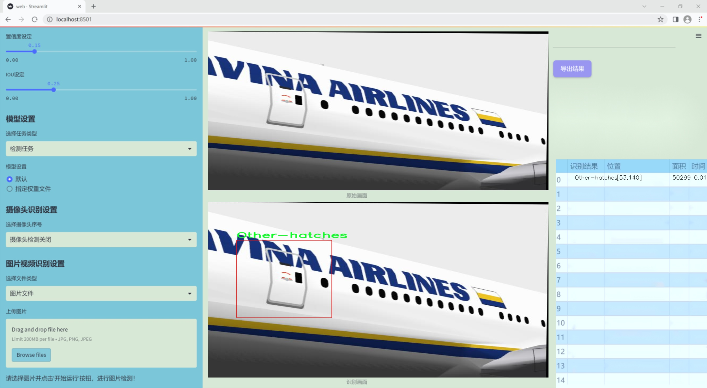
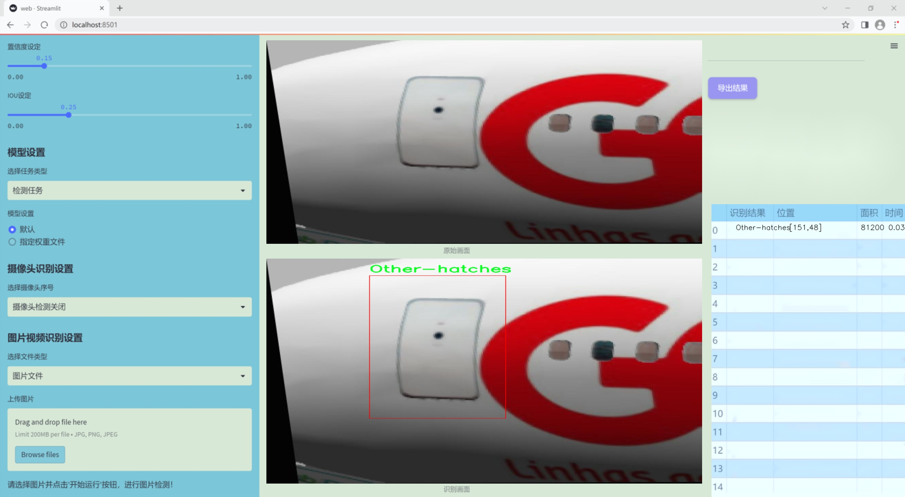
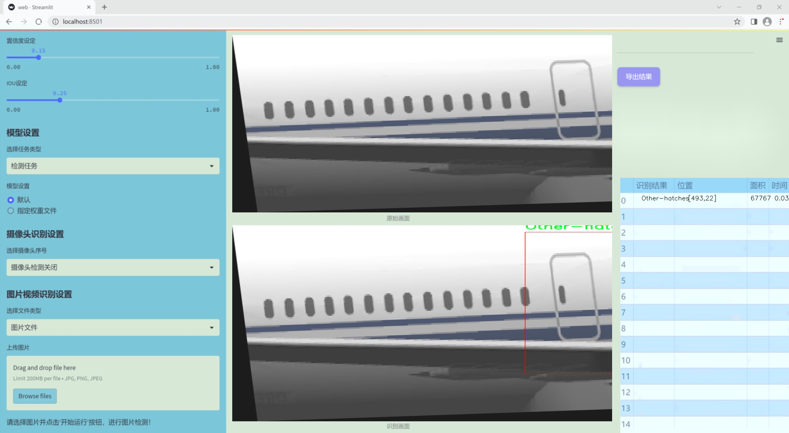
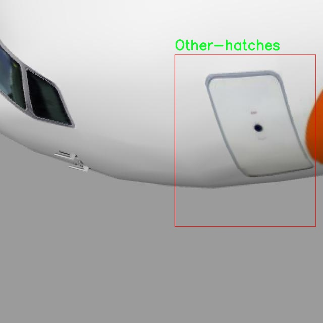
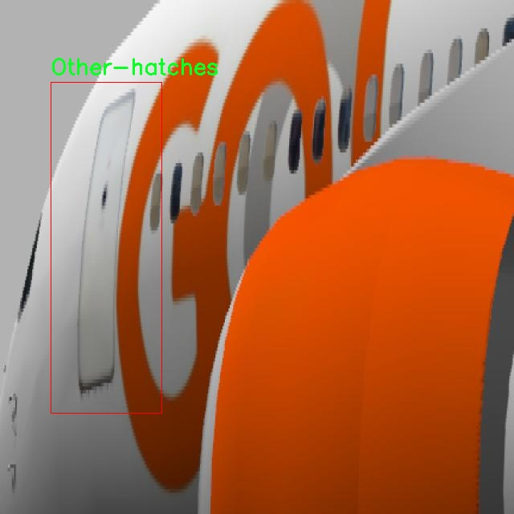
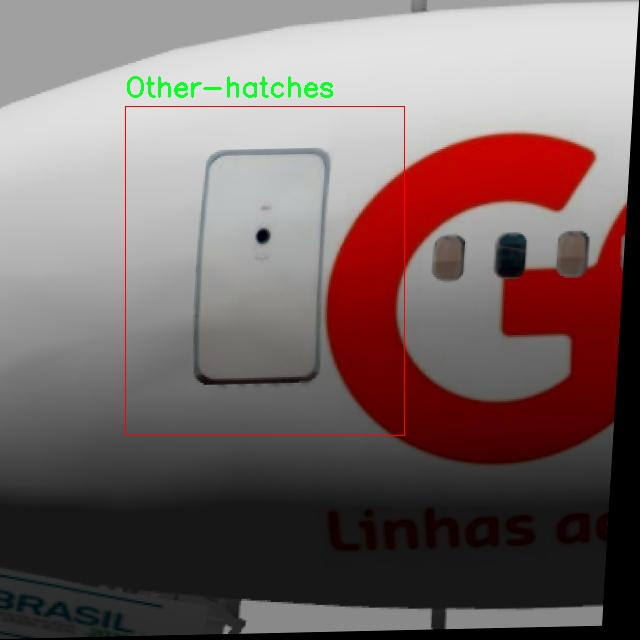
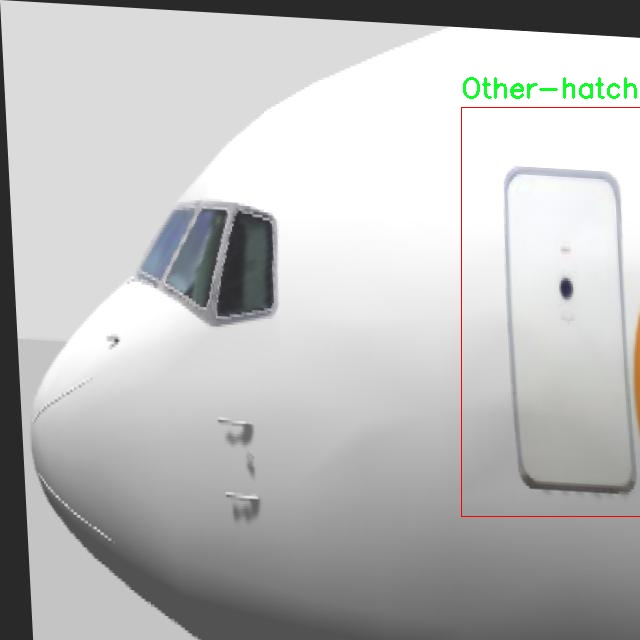
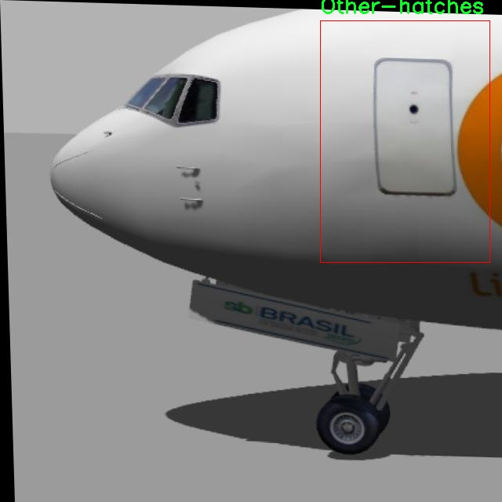

### 1.背景意义

研究背景与意义

随着航空工业的快速发展，飞机舱门的安全性和可靠性愈发受到重视。舱门作为飞机结构的重要组成部分，不仅在飞机的正常运行中起着至关重要的作用，还在紧急情况下对乘客的安全保障具有重要影响。因此，及时、准确地识别不同类型的舱门，对于维护航空安全、提高维修效率具有重要意义。传统的舱门识别方法往往依赖于人工检查和经验判断，效率低下且容易受到人为因素的影响。随着计算机视觉技术的不断进步，基于深度学习的自动化识别系统逐渐成为解决这一问题的有效手段。

本研究旨在基于改进的YOLOv11模型，构建一个高效的飞机舱门类型识别系统。该系统将能够自动识别“Other-hatches”和“Target-hatch”两种舱门类型，从而为航空公司和维修机构提供实时的舱门状态监测和分类服务。数据集的构建包含480张经过精细标注的图像，采用了多种数据增强技术，以提高模型的泛化能力和识别准确率。通过对图像进行自动方向调整、缩放、随机裁剪、水平翻转等处理，模型将能够更好地适应不同的环境和光照条件。

在航空安全领域，舱门的准确识别不仅有助于提升维修人员的工作效率，还能降低潜在的安全隐患。通过引入先进的计算机视觉技术，本研究不仅能够推动舱门识别技术的发展，还能为航空安全管理提供科学依据和技术支持。综上所述，基于改进YOLOv11的飞机舱门类型识别系统的研究具有重要的理论价值和实际应用意义，将为航空业的智能化和自动化进程贡献力量。

### 2.视频效果

[2.1 视频效果](https://www.bilibili.com/video/BV1kYm8YUEiM/)

### 3.图片效果







##### [项目涉及的源码数据来源链接](https://kdocs.cn/l/cszuIiCKVNis)**

注意：本项目提供训练的数据集和训练教程,由于版本持续更新,暂不提供权重文件（best.pt）,请按照6.训练教程进行训练后实现上图演示的效果。

### 4.数据集信息

##### 4.1 本项目数据集类别数＆类别名

nc: 2
names: ['Other-hatches', 'Target-hatch']


该项目为【目标检测】数据集，请在【训练教程和Web端加载模型教程（第三步）】这一步的时候按照【目标检测】部分的教程来训练

##### 4.2 本项目数据集信息介绍

本项目数据集信息介绍

本项目所使用的数据集专注于飞机舱门类型的识别，旨在通过改进YOLOv11模型来提升其在实际应用中的性能。数据集的主题围绕“9999”展开，涵盖了与飞机舱门相关的多种图像样本，旨在为模型提供丰富的训练数据，以便其能够准确区分不同类型的舱门。该数据集包含两个主要类别，分别为“Other-hatches”和“Target-hatch”。“Other-hatches”类别包括各种非目标舱门的图像，这些舱门可能在外观和功能上与目标舱门有所不同，而“Target-hatch”则专指我们希望模型能够识别的特定舱门类型。

数据集的构建经过精心设计，确保了样本的多样性和代表性。图像来源于不同的飞机型号和舱门设计，涵盖了多种角度和光照条件，以增强模型的泛化能力。每个类别的样本数量经过合理分配，以避免模型在训练过程中出现偏差。通过这种方式，我们期望模型能够在面对不同环境和条件时，依然保持高效的识别能力。

此外，数据集还包含了详细的标注信息，确保每个图像中的舱门类型都得到了准确的标识。这种高质量的标注将为模型的训练提供坚实的基础，使其能够学习到有效的特征表示，从而提高在实际应用中的识别精度。通过对该数据集的深入分析和利用，我们相信可以显著提升YOLOv11在飞机舱门类型识别任务中的表现，为航空安全和维护提供有力的技术支持。











### 5.全套项目环境部署视频教程（零基础手把手教学）

[5.1 所需软件PyCharm和Anaconda安装教程（第一步）](https://www.bilibili.com/video/BV1BoC1YCEKi/?spm_id_from=333.999.0.0&vd_source=bc9aec86d164b67a7004b996143742dc)


[5.2 安装Python虚拟环境创建和依赖库安装视频教程（第二步）](https://www.bilibili.com/video/BV1ZoC1YCEBw?spm_id_from=333.788.videopod.sections&vd_source=bc9aec86d164b67a7004b996143742dc)

### 6.改进YOLOv11训练教程和Web_UI前端加载模型教程（零基础手把手教学）

[6.1 改进YOLOv11训练教程和Web_UI前端加载模型教程（第三步）](https://www.bilibili.com/video/BV1BoC1YCEhR?spm_id_from=333.788.videopod.sections&vd_source=bc9aec86d164b67a7004b996143742dc)


按照上面的训练视频教程链接加载项目提供的数据集，运行train.py即可开始训练



     Epoch   gpu_mem       box       obj       cls    labels  img_size
     1/200     20.8G   0.01576   0.01955  0.007536        22      1280: 100%|██████████| 849/849 [14:42<00:00,  1.04s/it]
               Class     Images     Labels          P          R     mAP@.5 mAP@.5:.95: 100%|██████████| 213/213 [01:14<00:00,  2.87it/s]
                 all       3395      17314      0.994      0.957      0.0957      0.0843

     Epoch   gpu_mem       box       obj       cls    labels  img_size
     2/200     20.8G   0.01578   0.01923  0.007006        22      1280: 100%|██████████| 849/849 [14:44<00:00,  1.04s/it]
               Class     Images     Labels          P          R     mAP@.5 mAP@.5:.95: 100%|██████████| 213/213 [01:12<00:00,  2.95it/s]
                 all       3395      17314      0.996      0.956      0.0957      0.0845

     Epoch   gpu_mem       box       obj       cls    labels  img_size
     3/200     20.8G   0.01561    0.0191  0.006895        27      1280: 100%|██████████| 849/849 [10:56<00:00,  1.29it/s]
               Class     Images     Labels          P          R     mAP@.5 mAP@.5:.95: 100%|███████   | 187/213 [00:52<00:00,  4.04it/s]
                 all       3395      17314      0.996      0.957      0.0957      0.0845


###### [项目数据集下载链接](https://kdocs.cn/l/cszuIiCKVNis)

### 7.原始YOLOv11算法讲解

##### YOLO11简介

> YOLO11源码地址：https://github.com/ultralytics/ultralytics

Ultralytics
YOLO11是一款尖端的、最先进的模型，它在之前YOLO版本成功的基础上进行了构建，并引入了新功能和改进，以进一步提升性能和灵活性。YOLO11设计快速、准确且易于使用，使其成为各种物体检测和跟踪、实例分割、图像分类以及姿态估计任务的绝佳选择。  


**YOLO11创新点如下:**

YOLO 11主要改进包括：  
`增强的特征提取`：YOLO 11采用了改进的骨干和颈部架构，增强了特征提取功能，以实现更精确的目标检测。  
`优化的效率和速度`：优化的架构设计和优化的训练管道提供更快的处理速度，同时保持准确性和性能之间的平衡。  
`更高的精度，更少的参数`：YOLO11m在COCO数据集上实现了更高的平均精度（mAP），参数比YOLOv8m少22%，使其在不影响精度的情况下提高了计算效率。  
`跨环境的适应性`：YOLO 11可以部署在各种环境中，包括边缘设备、云平台和支持NVIDIA GPU的系统。  
`广泛的支持任务`：YOLO 11支持各种计算机视觉任务，如对象检测、实例分割、图像分类、姿态估计和面向对象检测（OBB）。

**YOLO11不同模型尺寸信息：**

YOLO11 提供5种不同的型号规模模型，以满足不同的应用需求：

Model| size (pixels)| mAPval 50-95| Speed CPU ONNX (ms)| Speed T4 TensorRT10
(ms)| params (M)| FLOPs (B)  
---|---|---|---|---|---|---  
YOLO11n| 640| 39.5| 56.1 ± 0.8| 1.5 ± 0.0| 2.6| 6.5  
YOLO11s| 640| 47.0| 90.0 ± 1.2| 2.5 ± 0.0| 9.4| 21.5  
YOLO11m| 640| 51.5| 183.2 ± 2.0| 4.7 ± 0.1| 20.1| 68.0  
YOLO11l| 640| 53.4| 238.6 ± 1.4| 6.2 ± 0.1| 25.3| 86.9  
YOLO11x| 640| 54.7| 462.8 ± 6.7| 11.3 ± 0.2| 56.9| 194.9  
  
**模型常用训练超参数参数说明：**  
`YOLOv11
模型的训练设置包括训练过程中使用的各种超参数和配置`。这些设置会影响模型的性能、速度和准确性。关键的训练设置包括批量大小、学习率、动量和权重衰减。此外，优化器、损失函数和训练数据集组成的选择也会影响训练过程。对这些设置进行仔细的调整和实验对于优化性能至关重要。  
**以下是一些常用的模型训练参数和说明：**

参数名| 默认值| 说明  
---|---|---  
`model`| `None`| 指定用于训练的模型文件。接受指向 `.pt` 预训练模型或 `.yaml`
配置文件。对于定义模型结构或初始化权重至关重要。  
`data`| `None`| 数据集配置文件的路径（例如
`coco8.yaml`).该文件包含特定于数据集的参数，包括训练数据和验证数据的路径、类名和类数。  
`epochs`| `100`| 训练总轮数。每个epoch代表对整个数据集进行一次完整的训练。调整该值会影响训练时间和模型性能。  
`patience`| `100`| 在验证指标没有改善的情况下，提前停止训练所需的epoch数。当性能趋于平稳时停止训练，有助于防止过度拟合。  
`batch`| `16`| 批量大小，有三种模式:设置为整数(例如，’ Batch =16 ‘)， 60% GPU内存利用率的自动模式(’ Batch
=-1 ‘)，或指定利用率分数的自动模式(’ Batch =0.70 ')。  
`imgsz`| `640`| 用于训练的目标图像尺寸。所有图像在输入模型前都会被调整到这一尺寸。影响模型精度和计算复杂度。  
`device`| `None`| 指定用于训练的计算设备：单个 GPU (`device=0`）、多个 GPU (`device=0,1`)、CPU
(`device=cpu`)，或苹果芯片的 MPS (`device=mps`).  
`workers`| `8`| 加载数据的工作线程数（每 `RANK` 多 GPU 训练）。影响数据预处理和输入模型的速度，尤其适用于多 GPU 设置。  
`name`| `None`| 训练运行的名称。用于在项目文件夹内创建一个子目录，用于存储训练日志和输出结果。  
`pretrained`| `True`| 决定是否从预处理模型开始训练。可以是布尔值，也可以是加载权重的特定模型的字符串路径。提高训练效率和模型性能。  
`optimizer`| `'auto'`| 为训练模型选择优化器。选项包括 `SGD`, `Adam`, `AdamW`, `NAdam`,
`RAdam`, `RMSProp` 等，或 `auto` 用于根据模型配置进行自动选择。影响收敛速度和稳定性  
`lr0`| `0.01`| 初始学习率（即 `SGD=1E-2`, `Adam=1E-3`) .调整这个值对优化过程至关重要，会影响模型权重的更新速度。  
`lrf`| `0.01`| 最终学习率占初始学习率的百分比 = (`lr0 * lrf`)，与调度程序结合使用，随着时间的推移调整学习率。  


**各损失函数作用说明：**  
`定位损失box_loss`：预测框与标定框之间的误差（GIoU），越小定位得越准；  
`分类损失cls_loss`：计算锚框与对应的标定分类是否正确，越小分类得越准；  
`动态特征损失（dfl_loss）`：DFLLoss是一种用于回归预测框与目标框之间距离的损失函数。在计算损失时，目标框需要缩放到特征图尺度，即除以相应的stride，并与预测的边界框计算Ciou
Loss，同时与预测的anchors中心点到各边的距离计算回归DFLLoss。  


### 8.200+种全套改进YOLOV11创新点原理讲解

#### 8.1 200+种全套改进YOLOV11创新点原理讲解大全

由于篇幅限制，每个创新点的具体原理讲解就不全部展开，具体见下列网址中的改进模块对应项目的技术原理博客网址【Blog】（创新点均为模块化搭建，原理适配YOLOv5~YOLOv11等各种版本）

[改进模块技术原理博客【Blog】网址链接](https://gitee.com/qunmasj/good)


#### 8.2 精选部分改进YOLOV11创新点原理讲解

###### 这里节选部分改进创新点展开原理讲解(完整的改进原理见上图和[改进模块技术原理博客链接](https://gitee.com/qunmasj/good)【如果此小节的图加载失败可以通过CSDN或者Github搜索该博客的标题访问原始博客，原始博客图片显示正常】

### Gold-YOLO


#### Preliminaries
YOLO系列的中间层结构采用了传统的FPN结构，其中包含多个分支用于多尺度特征融合。然而，它只充分融合来自相邻级别的特征，对于其他层次的信息只能间接地进行“递归”获取。

传统的FPN结构在信息传输过程中存在丢失大量信息的问题。这是因为层之间的信息交互仅限于中间层选择的信息，未被选择的信息在传输过程中被丢弃。这种情况导致某个Level的信息只能充分辅助相邻层，而对其他全局层的帮助较弱。因此，整体上信息融合的有效性可能受到限制。
为了避免在传输过程中丢失信息，本文采用了一种新颖的“聚集和分发”机制（GD），放弃了原始的递归方法。该机制使用一个统一的模块来收集和融合所有Level的信息，并将其分发到不同的Level。通过这种方式，作者不仅避免了传统FPN结构固有的信息丢失问题，还增强了中间层的部分信息融合能力，而且并没有显著增加延迟。


#### 低阶聚合和分发分支 Low-stage gather-and-distribute branch
从主干网络中选择输出的B2、B3、B4、B5特征进行融合，以获取保留小目标信息的高分辨率特征。


#### 高阶聚合和分发分支 High-stage gather-and-distribute branch
高级全局特征对齐模块（High-GD）将由低级全局特征对齐模块（Low-GD）生成的特征{P3, P4, P5}进行融合。


Transformer融合模块由多个堆叠的transformer组成，transformer块的数量为L。每个transformer块包括一个多头注意力块、一个前馈网络（FFN）和残差连接。采用与LeViT相同的设置来配置多头注意力块，使用16个通道作为键K和查询Q的头维度，32个通道作为值V的头维度。为了加速推理过程，将层归一化操作替换为批归一化，并将所有的GELU激活函数替换为ReLU。为了增强变换器块的局部连接，在两个1x1卷积层之间添加了一个深度卷积层。同时，将FFN的扩展因子设置为2，以在速度和计算成本之间取得平衡。


信息注入模块(Information injection module)： 高级全局特征对齐模块（High-GD）中的信息注入模块与低级全局特征对齐模块（Low-GD）中的相同。在高级阶段，局部特征（Flocal）等于Pi，因此公式如下所示：


#### 增强的跨层信息流动 Enhanced cross-layer information flow
为了进一步提升性能，从YOLOv6 中的PAFPN模块中得到启发，引入了Inject-LAF模块。该模块是注入模块的增强版，包括了一个轻量级相邻层融合（LAF）模块，该模块被添加到注入模块的输入位置。为了在速度和准确性之间取得平衡，设计了两个LAF模型：LAF低级模型和LAF高级模型，分别用于低级注入（合并相邻两层的特征）和高级注入（合并相邻一层的特征）。它们的结构如图5(b)所示。为了确保来自不同层级的特征图与目标大小对齐，在实现中的两个LAF模型仅使用了三个操作符：双线性插值（上采样过小的特征）、平均池化（下采样过大的特征）和1x1卷积（调整与目标通道不同的特征）。模型中的LAF模块与信息注入模块的结合有效地平衡了准确性和速度之间的关系。通过使用简化的操作，能够增加不同层级之间的信息流路径数量，从而提高性能而不显著增加延迟。


### 9.系统功能展示

图9.1.系统支持检测结果表格显示

  图9.2.系统支持置信度和IOU阈值手动调节

  图9.3.系统支持自定义加载权重文件best.pt(需要你通过步骤5中训练获得)

  图9.4.系统支持摄像头实时识别

  图9.5.系统支持图片识别

  图9.6.系统支持视频识别

  图9.7.系统支持识别结果文件自动保存

  图9.8.系统支持Excel导出检测结果数据


### 10. YOLOv11核心改进源码讲解

#### 10.1 rep_block.py

以下是经过精简和注释的核心代码部分，保留了最重要的功能和结构：

```python
import torch
import torch.nn as nn
import torch.nn.functional as F

# 定义一些核心的函数用于卷积和批归一化的转换
def transI_fusebn(kernel, bn):
    # 将卷积核和批归一化层的参数融合
    gamma = bn.weight
    std = (bn.running_var + bn.eps).sqrt()  # 计算标准差
    return kernel * ((gamma / std).reshape(-1, 1, 1, 1)), bn.bias - bn.running_mean * gamma / std

def conv_bn(in_channels, out_channels, kernel_size, stride=1, padding=0, dilation=1, groups=1):
    # 创建一个包含卷积层和批归一化层的顺序容器
    conv_layer = nn.Conv2d(in_channels=in_channels, out_channels=out_channels, kernel_size=kernel_size,
                           stride=stride, padding=padding, dilation=dilation, groups=groups,
                           bias=False)
    bn_layer = nn.BatchNorm2d(num_features=out_channels, affine=True)
    return nn.Sequential(conv_layer, bn_layer)

class DiverseBranchBlock(nn.Module):
    def __init__(self, in_channels, out_channels, kernel_size, stride=1, padding=None, dilation=1, groups=1):
        super(DiverseBranchBlock, self).__init__()
        
        # 设置卷积层的参数
        if padding is None:
            padding = kernel_size // 2  # 自动计算填充
        assert padding == kernel_size // 2

        # 定义原始卷积和批归一化
        self.dbb_origin = conv_bn(in_channels=in_channels, out_channels=out_channels, kernel_size=kernel_size,
                                  stride=stride, padding=padding, dilation=dilation, groups=groups)

        # 定义平均池化和批归一化
        self.dbb_avg = nn.Sequential(
            nn.Conv2d(in_channels=in_channels, out_channels=out_channels, kernel_size=1, stride=1, padding=0, groups=groups, bias=False),
            nn.BatchNorm2d(out_channels),
            nn.AvgPool2d(kernel_size=kernel_size, stride=stride, padding=0)
        )

    def forward(self, inputs):
        # 前向传播，计算输出
        out = self.dbb_origin(inputs)  # 原始卷积输出
        out += self.dbb_avg(inputs)     # 加上平均池化输出
        return out  # 返回最终输出

# 示例使用
if __name__ == "__main__":
    model = DiverseBranchBlock(in_channels=3, out_channels=16, kernel_size=3)
    x = torch.randn(1, 3, 224, 224)  # 输入张量
    output = model(x)  # 计算输出
    print(output.shape)  # 输出形状
```

### 代码说明：
1. **transI_fusebn**: 该函数用于将卷积层的权重和批归一化层的参数融合，以便在推理时减少计算量。
2. **conv_bn**: 该函数创建一个包含卷积层和批归一化层的顺序容器，方便后续使用。
3. **DiverseBranchBlock**: 这是一个自定义的神经网络模块，包含多个分支的卷积操作。
   - **构造函数**: 初始化卷积层和平均池化层。
   - **forward方法**: 定义前向传播过程，计算输入的输出。

通过这些核心部分的组合，可以构建出一个复杂的卷积神经网络模块，具有多种分支结构和操作。

这个文件 `rep_block.py` 主要定义了一些用于深度学习模型中的多分支卷积块（Diverse Branch Block）相关的类和函数。以下是对代码的逐步分析和说明。

首先，文件引入了必要的库，包括 PyTorch 和 NumPy。接着，定义了一些用于卷积和批归一化的转换函数。这些函数的主要作用是将卷积层和批归一化层的参数进行融合，以便在模型推理时能够更高效地使用。

接下来的几个函数 `transI_fusebn`、`transII_addbranch`、`transIII_1x1_kxk`、`transIV_depthconcat`、`transV_avg` 和 `transVI_multiscale` 分别用于不同的参数转换和处理，主要包括融合卷积和批归一化的权重与偏置、合并多个卷积的输出、生成平均池化的卷积核等。

在 `conv_bn` 函数中，定义了一个包含卷积层和批归一化层的组合模块，方便后续使用。

接下来，定义了多个类，分别是 `IdentityBasedConv1x1`、`BNAndPadLayer`、`DiverseBranchBlock`、`DiverseBranchBlockNOAct`、`DeepDiverseBranchBlock` 和 `WideDiverseBranchBlock`。这些类都是继承自 `nn.Module`，用于构建不同类型的卷积块。

`IdentityBasedConv1x1` 类实现了一个基于身份映射的 1x1 卷积层，确保输入和输出的通道数相同，并且在前向传播时添加了一个身份矩阵，以保持信息的传递。

`BNAndPadLayer` 类则是一个包含批归一化和填充的层，能够在卷积操作后进行归一化处理，并根据需要进行边缘填充。

`DiverseBranchBlock` 类是一个复杂的多分支卷积块，支持多种卷积操作（如 1x1、3x3、平均池化等），并且在部署时能够将这些操作融合为一个卷积层以提高推理效率。该类还支持初始化和参数获取等功能。

`DiverseBranchBlockNOAct` 类与 `DiverseBranchBlock` 类类似，但不包含非线性激活函数，适用于某些特定的网络结构。

`DeepDiverseBranchBlock` 和 `WideDiverseBranchBlock` 类是对 `DiverseBranchBlock` 的扩展，分别实现了更深或更宽的卷积结构，提供了更多的灵活性和功能。

整体来看，这个文件实现了多种复杂的卷积块，适用于深度学习模型中的特征提取和处理，尤其是在处理图像数据时。这些模块的设计旨在提高模型的表达能力和推理效率，同时保持较好的性能。

#### 10.2 utils.py

以下是代码中最核心的部分，并附上详细的中文注释：

```python
import torch
import torch.nn.functional as F

def multi_scale_deformable_attn_pytorch(
    value: torch.Tensor,
    value_spatial_shapes: torch.Tensor,
    sampling_locations: torch.Tensor,
    attention_weights: torch.Tensor,
) -> torch.Tensor:
    """
    多尺度可变形注意力机制。

    参数:
    - value: 输入特征图，形状为 (bs, C, num_heads, embed_dims)
    - value_spatial_shapes: 特征图的空间形状，形状为 (num_levels, 2)
    - sampling_locations: 采样位置，形状为 (bs, num_queries, num_heads, num_levels, num_points, 2)
    - attention_weights: 注意力权重，形状为 (bs, num_heads, num_queries, num_levels, num_points)

    返回:
    - output: 经过多尺度可变形注意力机制处理后的输出，形状为 (bs, num_queries, num_heads * embed_dims)
    """
    bs, _, num_heads, embed_dims = value.shape  # 获取输入特征图的批次大小、通道数、头数和嵌入维度
    _, num_queries, _, num_levels, num_points, _ = sampling_locations.shape  # 获取采样位置的相关参数

    # 将输入特征图根据空间形状拆分成多个特征图
    value_list = value.split([H_ * W_ for H_, W_ in value_spatial_shapes], dim=1)
    
    # 将采样位置转换到[-1, 1]范围
    sampling_grids = 2 * sampling_locations - 1
    sampling_value_list = []  # 用于存储每个尺度的采样值

    for level, (H_, W_) in enumerate(value_spatial_shapes):
        # 将当前尺度的特征图调整形状以便进行采样
        value_l_ = value_list[level].flatten(2).transpose(1, 2).reshape(bs * num_heads, embed_dims, H_, W_)
        
        # 获取当前尺度的采样网格
        sampling_grid_l_ = sampling_grids[:, :, :, level].transpose(1, 2).flatten(0, 1)
        
        # 使用双线性插值从特征图中采样
        sampling_value_l_ = F.grid_sample(
            value_l_, sampling_grid_l_, mode="bilinear", padding_mode="zeros", align_corners=False
        )
        sampling_value_list.append(sampling_value_l_)  # 将采样值添加到列表中

    # 调整注意力权重的形状以便后续计算
    attention_weights = attention_weights.transpose(1, 2).reshape(
        bs * num_heads, 1, num_queries, num_levels * num_points
    )
    
    # 计算最终输出
    output = (
        (torch.stack(sampling_value_list, dim=-2).flatten(-2) * attention_weights)  # 加权采样值
        .sum(-1)  # 对最后一个维度求和
        .view(bs, num_heads * embed_dims, num_queries)  # 调整输出形状
    )
    
    return output.transpose(1, 2).contiguous()  # 返回最终输出
```

### 代码说明：
1. **输入参数**：
   - `value`：输入特征图，包含多个头和嵌入维度。
   - `value_spatial_shapes`：特征图的空间形状，指示每个尺度的高度和宽度。
   - `sampling_locations`：用于采样的位置信息，指示在特征图上要采样的位置。
   - `attention_weights`：注意力权重，用于加权采样值。

2. **主要步骤**：
   - 将输入特征图拆分为多个尺度的特征图。
   - 将采样位置转换到[-1, 1]范围，以适应`grid_sample`函数。
   - 对每个尺度的特征图进行双线性插值采样。
   - 计算加权后的采样值并求和，得到最终输出。

3. **输出**：
   - 返回经过多尺度可变形注意力机制处理后的输出，形状为 `(bs, num_queries, num_heads * embed_dims)`。

这个程序文件 `utils.py` 是一个用于实现多种功能的工具模块，主要与深度学习中的模型构建和操作相关，特别是在使用 PyTorch 框架时。文件中包含了一些常用的函数和操作，下面是对这些内容的逐一讲解。

首先，文件导入了一些必要的库，包括 `copy`、`math`、`numpy` 和 `torch` 及其子模块。这些库提供了深度学习所需的基础功能，如张量操作、神经网络构建等。

接下来，定义了一个名为 `_get_clones` 的函数，该函数用于创建给定模块的多个克隆副本。它使用 `copy.deepcopy` 来确保每个克隆都是独立的，返回一个 `nn.ModuleList`，这在构建具有多个相同层的网络时非常有用。

`bias_init_with_prob` 函数用于根据给定的先验概率初始化卷积或全连接层的偏置值。通过计算负对数几率，它返回一个适合于二分类问题的偏置初始化值。

`linear_init` 函数用于初始化线性模块的权重和偏置。它根据模块的权重形状计算一个边界值，并使用均匀分布在这个边界内随机初始化权重和偏置。这种初始化方法有助于加速模型的收敛。

`inverse_sigmoid` 函数计算张量的反 sigmoid 函数。它首先将输入张量限制在 [0, 1] 的范围内，然后通过对数运算计算反 sigmoid 值。这个函数在一些特定的深度学习任务中可能会用到，例如在处理概率分布时。

最后，`multi_scale_deformable_attn_pytorch` 函数实现了多尺度可变形注意力机制。该函数接收多个参数，包括值张量、空间形状、采样位置和注意力权重。函数内部首先对输入的值张量进行分割，然后计算采样网格并使用 `F.grid_sample` 进行插值操作，最后根据注意力权重对采样值进行加权求和，返回最终的输出。这种多尺度的注意力机制在目标检测和图像分割等任务中非常有效，能够提高模型对不同尺度特征的捕捉能力。

总的来说，这个 `utils.py` 文件提供了一些深度学习模型构建中常用的工具函数，特别是在实现复杂的注意力机制时，能够帮助简化代码并提高可读性。

#### 10.3 val.py

以下是代码中最核心的部分，并附上详细的中文注释：

```python
class DetectionValidator(BaseValidator):
    """
    扩展自 BaseValidator 类的检测模型验证器。
    """

    def __init__(self, dataloader=None, save_dir=None, pbar=None, args=None, _callbacks=None):
        """初始化检测模型所需的变量和设置。"""
        super().__init__(dataloader, save_dir, pbar, args, _callbacks)
        self.nt_per_class = None  # 每个类别的目标数量
        self.is_coco = False  # 是否为 COCO 数据集
        self.class_map = None  # 类别映射
        self.args.task = "detect"  # 任务类型设置为检测
        self.metrics = DetMetrics(save_dir=self.save_dir, on_plot=self.on_plot)  # 初始化检测指标
        self.iouv = torch.linspace(0.5, 0.95, 10)  # mAP@0.5:0.95 的 IoU 向量
        self.niou = self.iouv.numel()  # IoU 的数量
        self.lb = []  # 用于自动标注

    def preprocess(self, batch):
        """对 YOLO 训练的图像批次进行预处理。"""
        # 将图像移动到设备上并进行归一化处理
        batch["img"] = batch["img"].to(self.device, non_blocking=True)
        batch["img"] = (batch["img"].half() if self.args.half else batch["img"].float()) / 255
        for k in ["batch_idx", "cls", "bboxes"]:
            batch[k] = batch[k].to(self.device)  # 将其他数据也移动到设备上

        # 如果需要保存混合数据，进行处理
        if self.args.save_hybrid:
            height, width = batch["img"].shape[2:]  # 获取图像的高度和宽度
            nb = len(batch["img"])  # 批次中图像的数量
            bboxes = batch["bboxes"] * torch.tensor((width, height, width, height), device=self.device)  # 计算边界框
            self.lb = (
                [
                    torch.cat([batch["cls"][batch["batch_idx"] == i], bboxes[batch["batch_idx"] == i]], dim=-1)
                    for i in range(nb)
                ]
                if self.args.save_hybrid
                else []
            )  # 为自动标注准备数据

        return batch  # 返回处理后的批次

    def postprocess(self, preds):
        """对预测输出应用非极大值抑制。"""
        return ops.non_max_suppression(
            preds,
            self.args.conf,  # 置信度阈值
            self.args.iou,  # IoU 阈值
            labels=self.lb,  # 标签
            multi_label=True,  # 多标签模式
            agnostic=self.args.single_cls,  # 是否单类
            max_det=self.args.max_det,  # 最大检测数量
        )

    def update_metrics(self, preds, batch):
        """更新指标。"""
        for si, pred in enumerate(preds):  # 遍历每个预测
            self.seen += 1  # 统计已处理的图像数量
            npr = len(pred)  # 当前预测的数量
            stat = dict(
                conf=torch.zeros(0, device=self.device),  # 置信度
                pred_cls=torch.zeros(0, device=self.device),  # 预测类别
                tp=torch.zeros(npr, self.niou, dtype=torch.bool, device=self.device),  # 真阳性
            )
            pbatch = self._prepare_batch(si, batch)  # 准备当前批次数据
            cls, bbox = pbatch.pop("cls"), pbatch.pop("bbox")  # 获取真实类别和边界框
            nl = len(cls)  # 真实标签数量
            stat["target_cls"] = cls  # 记录真实类别

            if npr == 0:  # 如果没有预测
                if nl:  # 如果有真实标签
                    for k in self.stats.keys():
                        self.stats[k].append(stat[k])  # 更新统计数据
                continue  # 继续下一个预测

            # 处理预测
            if self.args.single_cls:
                pred[:, 5] = 0  # 如果是单类，设置类别为 0
            predn = self._prepare_pred(pred, pbatch)  # 准备预测数据
            stat["conf"] = predn[:, 4]  # 记录置信度
            stat["pred_cls"] = predn[:, 5]  # 记录预测类别

            # 评估
            if nl:  # 如果有真实标签
                stat["tp"] = self._process_batch(predn, bbox, cls)  # 处理批次，计算真阳性
            for k in self.stats.keys():
                self.stats[k].append(stat[k])  # 更新统计数据

            # 保存预测结果
            if self.args.save_json:
                self.pred_to_json(predn, batch["im_file"][si])  # 保存为 JSON 格式
            if self.args.save_txt:
                file = self.save_dir / "labels" / f'{Path(batch["im_file"][si]).stem}.txt'
                self.save_one_txt(predn, self.args.save_conf, pbatch["ori_shape"], file)  # 保存为 TXT 格式

    def get_stats(self):
        """返回指标统计信息和结果字典。"""
        stats = {k: torch.cat(v, 0).cpu().numpy() for k, v in self.stats.items()}  # 转换为 numpy 数组
        if len(stats) and stats["tp"].any():  # 如果有真阳性
            self.metrics.process(**stats)  # 处理指标
        self.nt_per_class = np.bincount(
            stats["target_cls"].astype(int), minlength=self.nc
        )  # 计算每个类别的目标数量
        return self.metrics.results_dict  # 返回结果字典
```

### 代码核心部分解释：
1. **DetectionValidator 类**：这是一个用于验证检测模型的类，继承自 `BaseValidator`。它包含了模型验证所需的所有方法和属性。
2. **初始化方法 `__init__`**：初始化一些重要的属性，如类别数量、是否为 COCO 数据集、指标对象等。
3. **预处理方法 `preprocess`**：对输入的图像批次进行处理，包括移动到设备、归一化等。
4. **后处理方法 `postprocess`**：对模型的预测结果应用非极大值抑制，以减少冗余的检测框。
5. **更新指标方法 `update_metrics`**：在每次处理完一个批次后更新模型的性能指标。
6. **获取统计信息方法 `get_stats`**：计算并返回模型在验证集上的性能指标。

以上是代码的核心部分及其详细注释，旨在帮助理解 YOLO 模型的验证过程。

这个程序文件 `val.py` 是一个用于目标检测模型验证的类 `DetectionValidator` 的实现，继承自 `BaseValidator`。该类主要用于评估 YOLO（You Only Look Once）模型的性能，具体包括数据预处理、指标计算、结果输出等功能。

在初始化方法中，`DetectionValidator` 接收多个参数，包括数据加载器、保存目录、进度条、参数设置等。它还定义了一些与验证相关的变量，如每类的目标数量、是否为 COCO 数据集、类别映射等，并初始化了一些评估指标。

`preprocess` 方法用于对输入的图像批次进行预处理，包括将图像数据转移到指定设备、调整数据类型并进行归一化处理。它还会根据设置生成用于自动标注的标签。

`init_metrics` 方法用于初始化评估指标，判断数据集是否为 COCO 格式，并设置相应的类别映射和其他统计信息。

`get_desc` 方法返回一个格式化的字符串，用于总结每个类别的指标信息。

`postprocess` 方法应用非极大值抑制（NMS）来处理模型的预测输出，以减少重叠的边界框。

`_prepare_batch` 和 `_prepare_pred` 方法分别用于准备输入的图像和标签，以及处理模型的预测结果，以便后续的评估。

`update_metrics` 方法负责更新评估指标，包括计算真阳性、预测类别等。它会根据预测结果和真实标签进行比较，并更新混淆矩阵。

`finalize_metrics` 方法在所有批次处理完成后设置最终的指标值，包括速度和混淆矩阵。

`get_stats` 方法返回计算后的指标统计信息，利用 NumPy 处理数据并返回结果字典。

`print_results` 方法打印训练或验证集的每个类别的指标，输出包括每个类别的图像数量、实例数量以及各类指标的平均值。

`_process_batch` 方法计算正确预测的矩阵，使用 IoU（Intersection over Union）来评估预测与真实边界框的重叠程度。

`build_dataset` 和 `get_dataloader` 方法用于构建 YOLO 数据集和返回数据加载器，以便于后续的验证过程。

`plot_val_samples` 和 `plot_predictions` 方法用于可视化验证样本和模型的预测结果，并将其保存为图像文件。

`save_one_txt` 方法将 YOLO 的检测结果保存为特定格式的文本文件，`pred_to_json` 方法将预测结果序列化为 COCO JSON 格式。

`eval_json` 方法用于评估 YOLO 输出的 JSON 格式结果，并返回性能统计信息，使用 COCO API 计算 mAP（mean Average Precision）。

整体来看，这个文件实现了一个完整的目标检测模型验证流程，涵盖了从数据预处理到结果输出的各个环节，能够有效地评估 YOLO 模型在特定数据集上的性能。

#### 10.4 VanillaNet.py

以下是简化后的核心代码，并附上详细的中文注释：

```python
import torch
import torch.nn as nn
import torch.nn.functional as F
from timm.layers import weight_init

# 定义激活函数类
class Activation(nn.ReLU):
    def __init__(self, dim, act_num=3, deploy=False):
        super(Activation, self).__init__()
        self.deploy = deploy
        # 权重初始化
        self.weight = torch.nn.Parameter(torch.randn(dim, 1, act_num*2 + 1, act_num*2 + 1))
        self.bias = None
        self.bn = nn.BatchNorm2d(dim, eps=1e-6)  # 批归一化
        self.dim = dim
        self.act_num = act_num
        weight_init.trunc_normal_(self.weight, std=.02)  # 权重截断正态初始化

    def forward(self, x):
        # 前向传播
        if self.deploy:
            return F.conv2d(
                super(Activation, self).forward(x), 
                self.weight, self.bias, padding=(self.act_num*2 + 1)//2, groups=self.dim)
        else:
            return self.bn(F.conv2d(
                super(Activation, self).forward(x),
                self.weight, padding=self.act_num, groups=self.dim))

    def switch_to_deploy(self):
        # 切换到部署模式，融合批归一化
        if not self.deploy:
            kernel, bias = self._fuse_bn_tensor(self.weight, self.bn)
            self.weight.data = kernel
            self.bias = torch.nn.Parameter(torch.zeros(self.dim))
            self.bias.data = bias
            self.__delattr__('bn')  # 删除bn属性
            self.deploy = True

    def _fuse_bn_tensor(self, weight, bn):
        # 融合批归一化和卷积层的权重
        kernel = weight
        running_mean = bn.running_mean
        running_var = bn.running_var
        gamma = bn.weight
        beta = bn.bias
        eps = bn.eps
        std = (running_var + eps).sqrt()
        t = (gamma / std).reshape(-1, 1, 1, 1)
        return kernel * t, beta + (0 - running_mean) * gamma / std

# 定义网络的基本模块
class Block(nn.Module):
    def __init__(self, dim, dim_out, act_num=3, stride=2, deploy=False):
        super().__init__()
        self.deploy = deploy
        if self.deploy:
            self.conv = nn.Conv2d(dim, dim_out, kernel_size=1)
        else:
            self.conv1 = nn.Sequential(
                nn.Conv2d(dim, dim, kernel_size=1),
                nn.BatchNorm2d(dim, eps=1e-6),
            )
            self.conv2 = nn.Sequential(
                nn.Conv2d(dim, dim_out, kernel_size=1),
                nn.BatchNorm2d(dim_out, eps=1e-6)
            )
        self.pool = nn.MaxPool2d(stride) if stride != 1 else nn.Identity()  # 池化层
        self.act = Activation(dim_out, act_num)  # 激活函数

    def forward(self, x):
        # 前向传播
        if self.deploy:
            x = self.conv(x)
        else:
            x = self.conv1(x)
            x = F.leaky_relu(x, negative_slope=1)  # 使用Leaky ReLU激活
            x = self.conv2(x)

        x = self.pool(x)  # 池化
        x = self.act(x)  # 激活
        return x

# 定义VanillaNet网络
class VanillaNet(nn.Module):
    def __init__(self, in_chans=3, num_classes=1000, dims=[96, 192, 384, 768], strides=[2, 2, 2, 1], deploy=False):
        super().__init__()
        self.deploy = deploy
        if self.deploy:
            self.stem = nn.Sequential(
                nn.Conv2d(in_chans, dims[0], kernel_size=4, stride=4),
                Activation(dims[0])
            )
        else:
            self.stem1 = nn.Sequential(
                nn.Conv2d(in_chans, dims[0], kernel_size=4, stride=4),
                nn.BatchNorm2d(dims[0], eps=1e-6),
            )
            self.stem2 = nn.Sequential(
                nn.Conv2d(dims[0], dims[0], kernel_size=1, stride=1),
                nn.BatchNorm2d(dims[0], eps=1e-6),
                Activation(dims[0])
            )

        self.stages = nn.ModuleList()
        for i in range(len(strides)):
            stage = Block(dim=dims[i], dim_out=dims[i+1], act_num=3, stride=strides[i], deploy=deploy)
            self.stages.append(stage)

    def forward(self, x):
        # 前向传播
        if self.deploy:
            x = self.stem(x)
        else:
            x = self.stem1(x)
            x = F.leaky_relu(x, negative_slope=1)
            x = self.stem2(x)

        for stage in self.stages:
            x = stage(x)  # 通过每个Block进行前向传播
        return x

# 示例用法
if __name__ == '__main__':
    inputs = torch.randn((1, 3, 640, 640))  # 随机输入
    model = VanillaNet()  # 创建模型
    pred = model(inputs)  # 前向传播
    print(pred.size())  # 输出预测结果的尺寸
```

### 代码注释说明：
1. **Activation类**：定义了一个自定义的激活函数类，继承自ReLU，包含权重和偏置的初始化，以及前向传播和批归一化的融合。
2. **Block类**：定义了网络的基本模块，包含卷积层、池化层和激活函数。根据是否部署选择不同的前向传播路径。
3. **VanillaNet类**：定义了整个网络结构，包括输入层、多个Block和前向传播逻辑。
4. **示例用法**：在主程序中创建一个随机输入并通过模型进行前向传播，输出预测结果的尺寸。

该程序文件`VanillaNet.py`实现了一个名为VanillaNet的深度学习模型，主要用于图像处理任务。代码中包含了模型的定义、构建和预训练权重的加载等功能。

首先，程序导入了必要的库，包括PyTorch及其神经网络模块，以及一些辅助函数。接着，定义了一个`activation`类，继承自`nn.ReLU`，用于实现带有可学习参数的激活函数。该类在初始化时创建了权重和偏置，并定义了前向传播的方法。根据`deploy`参数的不同，前向传播的方式也有所不同，支持在训练和推理阶段的不同处理。

接下来，定义了一个`Block`类，表示网络中的基本构建块。该类包含多个卷积层和激活函数，并支持可选的池化操作。根据`deploy`参数，`Block`的构造和前向传播也会有所不同，确保在推理阶段的高效性。

`VanillaNet`类是整个模型的核心，包含了多个`Block`的堆叠。模型的构造函数接收输入通道数、类别数、特征维度、丢弃率等参数，并根据这些参数构建网络结构。模型的前向传播方法会通过各个阶段处理输入数据，并在特定的尺度下提取特征。

在模型的构造过程中，定义了一个`_init_weights`方法，用于初始化卷积层和线性层的权重。模型还提供了`change_act`方法，允许在不同阶段更改激活函数的学习率。

此外，程序还实现了一个`update_weight`函数，用于更新模型的权重，确保加载的权重与模型的结构匹配。多个`vanillanet_x`函数则是用来创建不同配置的VanillaNet模型，并支持加载预训练权重。

最后，在`__main__`部分，程序创建了一个输入张量并实例化了`vanillanet_10`模型，进行一次前向传播并打印输出特征的尺寸。

总体来说，该文件实现了一个灵活且高效的深度学习模型结构，支持多种配置和预训练权重的加载，适用于图像分类等任务。

### 11.完整训练+Web前端界面+200+种全套创新点源码、数据集获取


# [下载链接：https://mbd.pub/o/bread/Z5WbmJ5w](https://mbd.pub/o/bread/Z5WbmJ5w)